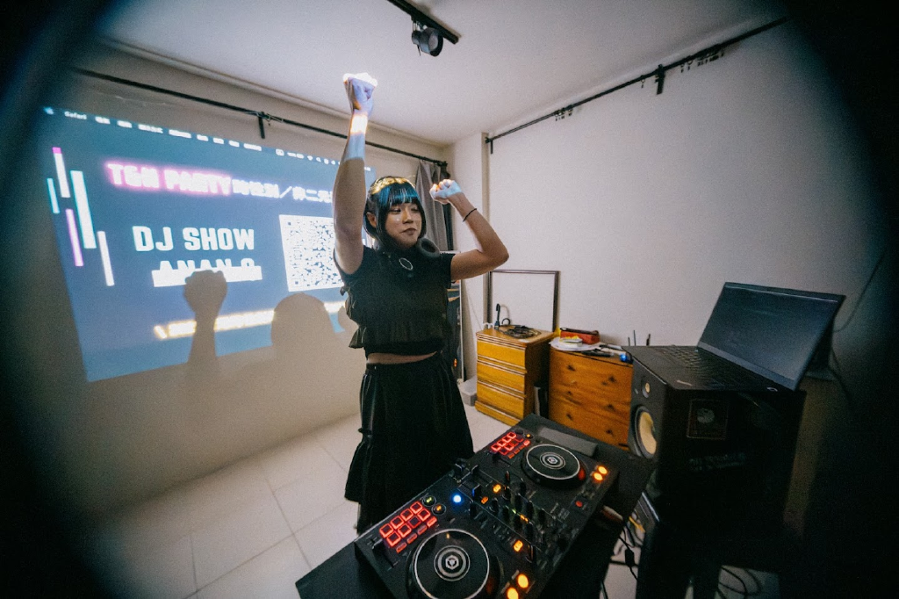
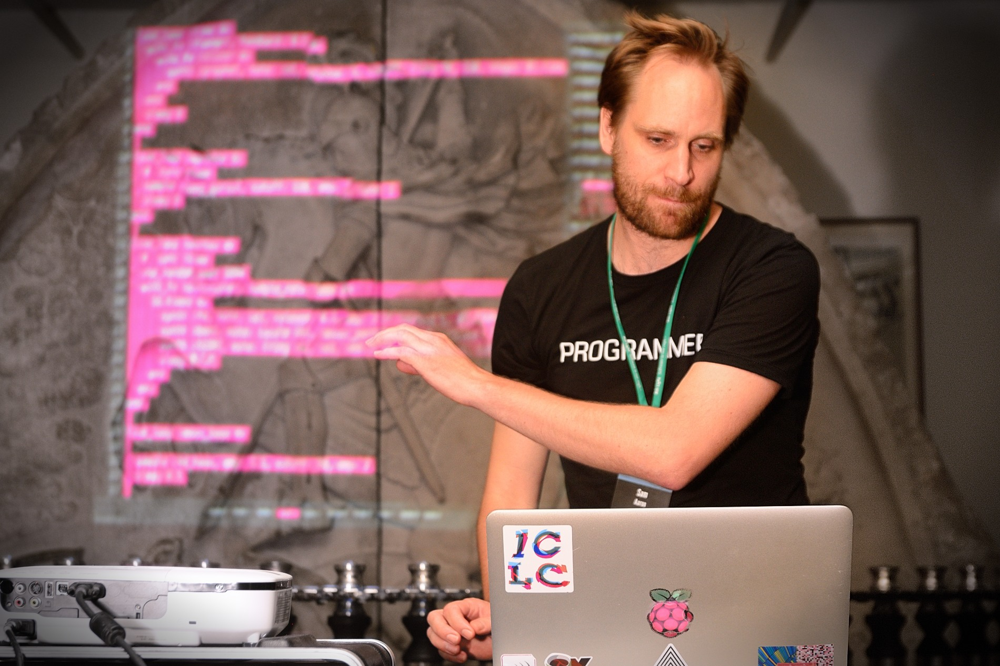
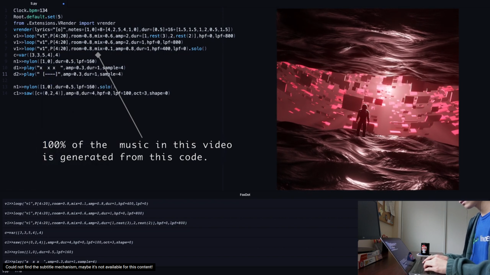
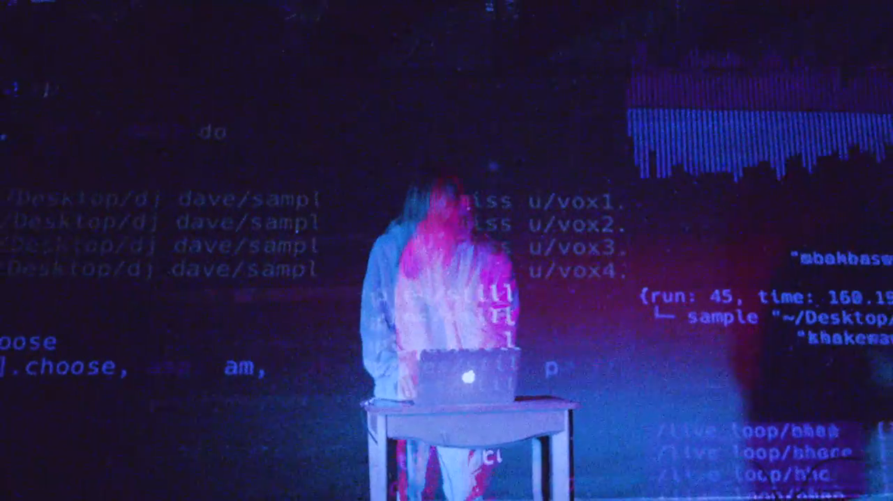
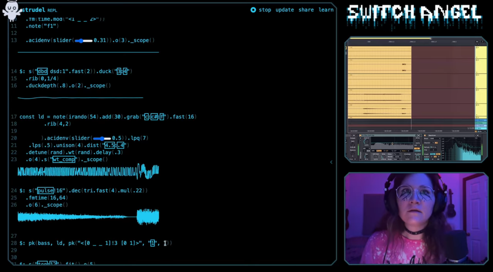

# About Me

**JN / giveanornot / ananQ** \
https://giveanornot.com\
jn@giveanornot.com



- Majored in computer science
- Cloud Infra Engineer, currently

<!--end_slide-->

# About Me (Music Related)

**JN / giveanornot / ananQ** \
https://giveanornot.com\
jn@giveanornot.com


- Almost forgot how to play guitar
- Worked at the ticket booth at The Wall Livehouse
- So... I learned how to DJ there

<!--end_slide-->

# Genres I play

## DJ

- Electro Swing
- Future Funk
- Neo City Pop
- J-Pop

## Livecoding

- Techno House
- Deep House
- Not sure yet...

<!--end_slide-->

# Trying out the Languages

- Sonic Pi
- FoxDot
- Tidal Cycles
- Strudel

<!--end_slide-->

# Sonic Pi (Ruby)

```ruby
live_loop :beats do
  sample :bd_tek
  sleep 0.5
end

live_loop :bass do
  use_synth :tb303
  play :e1, release: 4, cutoff: 100, cutoff_attack: 0.1
  sleep 4
end
```

source: Gemini

<!--end_slide-->

# FoxDot (Python)

```Python
## verse 1 ##
d1 >> play("X.", amplify = 1).solo()
d7 >> play("#",dur = 32)
l2 >> loop(verse1, P[:32], room = 0.5, dur = 1, sus = 1, echo = 0, lpf = 4000)

## verse 2 ##
d4 >> play("[--]", amp = PRand([1, 0.8, 0.7]))
p1 >> blip([-2, 0, 1, 2, 4, 5], oct = 4, lpf = 1000, dur = 1/4, pan = linvar([-1, 1], 16), fmod=0)
l2 >> loop(verse2, P[:32], room  = 0.5)
```

<!--end_slide-->

# Tidal Cycles (Haskell)

```haskell
d1 $ struct "t(<9 7>,16)"
  $ n (scale "minor"
        $ floor <$> (range "<0 4 -8>" "<12 14 13 -13>" sine)
      )
  # sound "supersaw"
  # legato 0.5
  # lpf (range 400 5000 saw) # lpq 0.1
```

~~I haven't tried to learn this TBH~~

source: [Tidal Cycles Course](https://tidalcycles.org/docs/patternlib/tutorials/course2)

<!--end_slide-->

# Strudel (JavaScript)

```js
// "coastline" @by eddyflux
// @version 1.0
samples('github:eddyflux/crate')
setcps(.75)
let chords = chord("<Bbm9 Fm9>/4").dict('ireal')
stack(
  stack( // DRUMS
    s("bd").struct("<[x*<1 2> [~@3 x]] x>"),
    s("~ [rim, sd:<2 3>]").room("<0 .2>"),
    n("[0 <1 3>]*<2!3 4>").s("hh"),
    s("rd:<1!3 2>*2").mask("<0 0 1 1>/16").gain(.5)
  ).bank('crate')
  .mask("<[0 1] 1 1 1>/16".early(.5))
  // ...
```

Try it out: [Strudel Getting Started](https://strudel.cc/workshop/getting-started/)

<!--end_slide-->

# Artists Influnced Me A Lot

## Sam Aaron

https://www.youtube.com/watch?v=rnCE7hxNGXw
<!--end_slide-->

## SleepyAstroboi

https://www.youtube.com/watch?v=-NFyVhcBWq8
<!--end_slide-->

## DJ_Dave

https://www.youtube.com/watch?v=nXzTGiLcRL4
<!--end_slide-->

## Switch Angel

https://www.youtube.com/watch?v=AifAIqHezb8
<!--end_slide-->

<!-- jump_to_middle -->
Let's dive into the code
---
<!--end_slide-->

<!-- jump_to_middle -->
How can it go further?
---
<!--end_slide-->


<!-- jump_to_middle -->
Thank You
---
